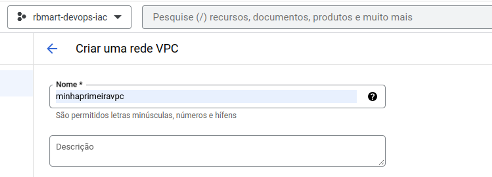
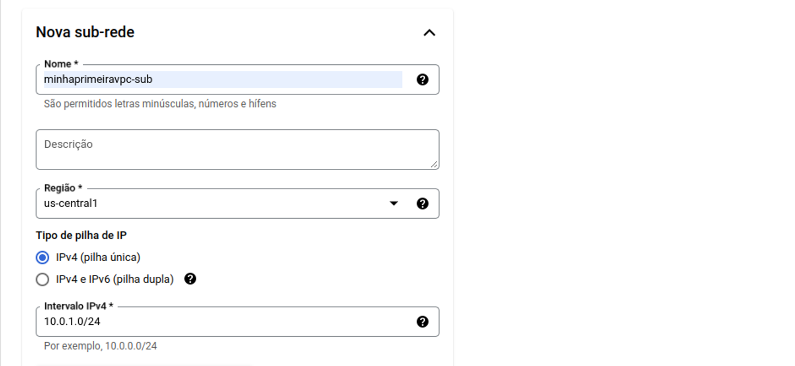
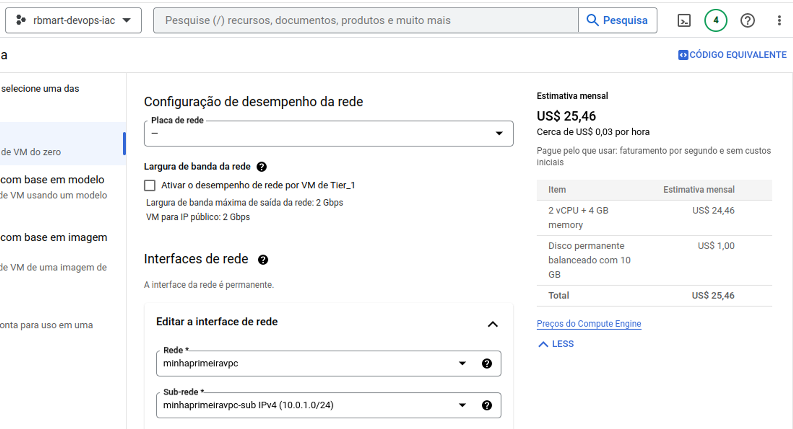
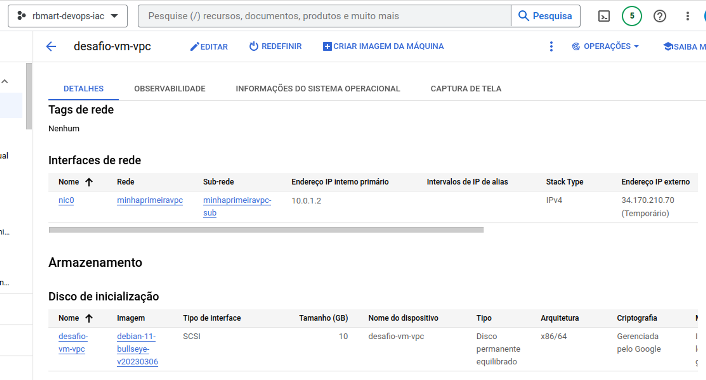

# Criando a Primeira VPC e Máquina Virtual pelo Console GCP

Este desafio de projeto consiste em criar a primeira rede VPC no Google Cloud Platform (GCP) através do console, personalizando uma sub-rede e, em seguida, criar uma instância utilizando essa rede.

- Para começar,  acessamos o console do GCP e criamos uma nova rede VPC. Nesse passo definimos um nome para a rede.

- Em seguida, criamos uma sub-rede personalizada dentro da rede VPC criada anteriormente. Para isso, é necessário definir um nome para a sub-rede, bem como o intervalo de endereços IP que a sub-rede utilizará. Além disso, é possível definir outras configurações, como o nome da zona onde a sub-rede será criada.

Com a sub-rede personalizada criada, é possível prosseguir para a criação de uma instância. Nesse processo, é necessário escolher a região e a zona em que a instância será criada, bem como definir as configurações da máquina virtual, como CPU, memória e disco. Além disso, é preciso selecionar a rede VPC e a sub-rede personalizada criadas anteriormente.

Após a conclusão desses passos, a instância será criada e configurada para utilizar a rede VPC e a sub-rede personalizada. Assim, é possível utilizar a instância para executar aplicativos e serviços na nuvem do Google Cloud Platform.

